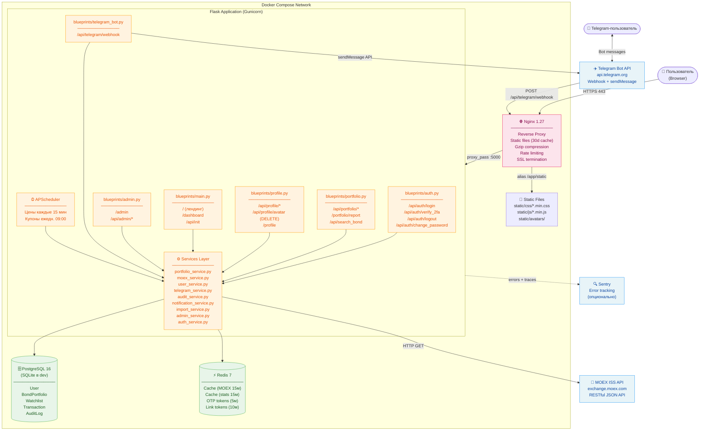
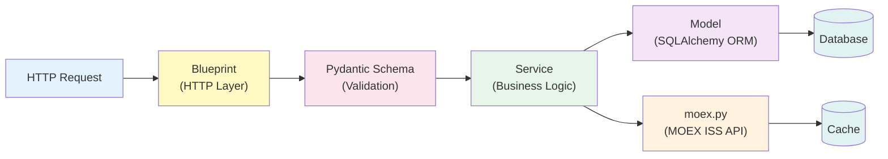
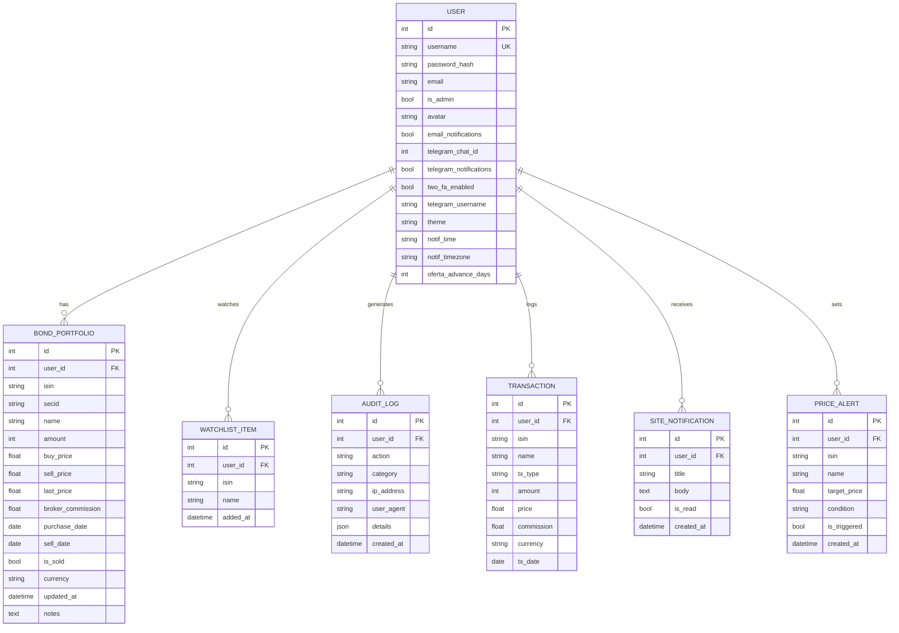
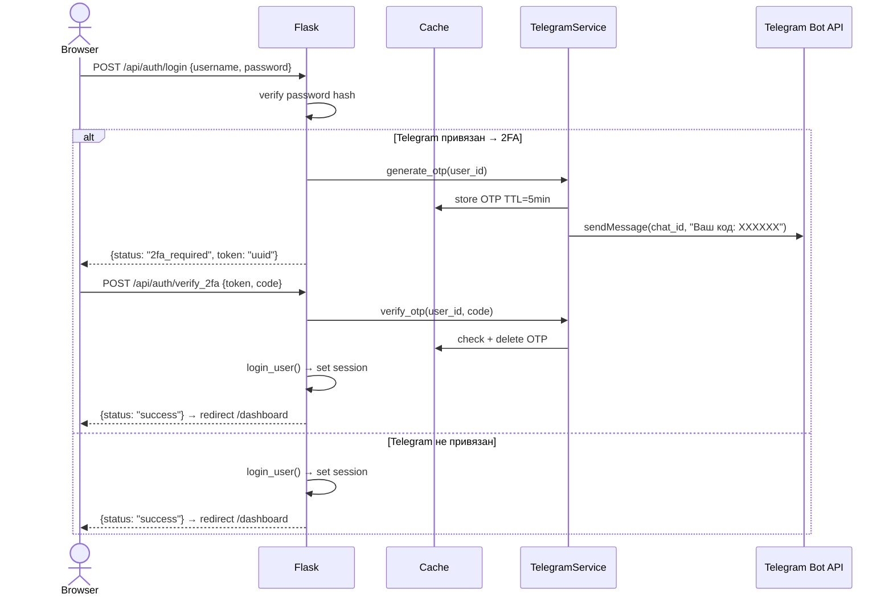
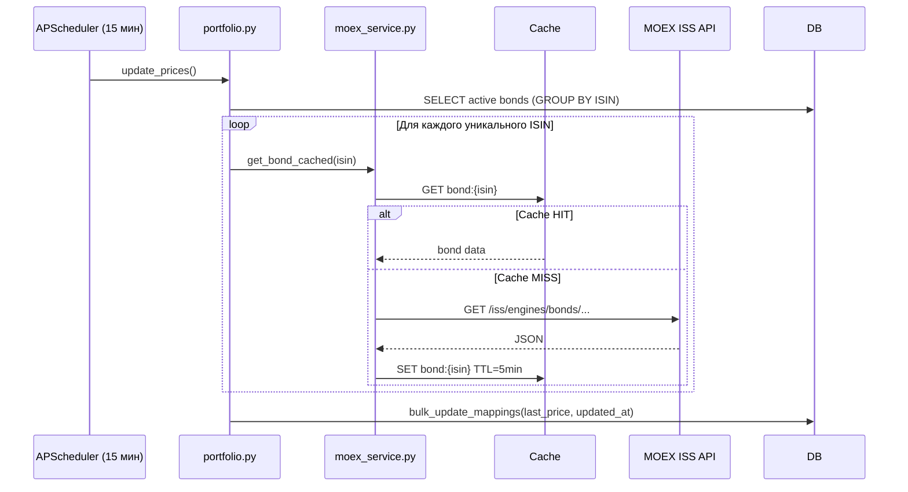
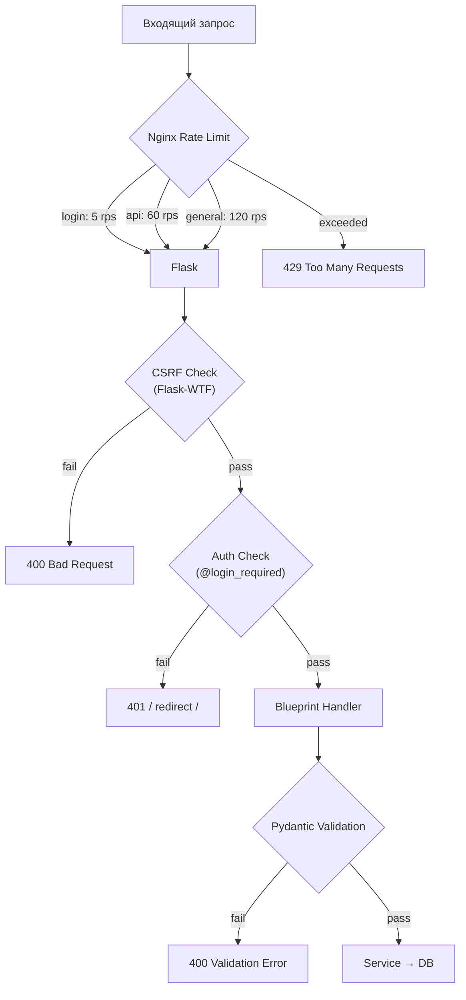

# InvestTrack — Архитектура системы

> C4 Level 2 (Container diagram). Визуализация через [Mermaid](https://mermaid.js.org/).

---

## Обзор контейнеров

---

## Слои приложения

| Слой | Файлы | Ответственность |
|------|-------|----------------|
| HTTP | `blueprints/*.py` | Парсинг запроса → вызов сервиса → возврат JSON/HTML |
| Validation | `schemas/*.py` | Pydantic v2 валидация входящих данных |
| Business Logic | `services/*.py` | Расчёты, внешние API, бизнес-правила |
| Data | `models.py`, `moex.py` | ORM-модели, прямой доступ к MOEX |
| Infrastructure | `extensions.py`, `config.py` | db, cache, limiter |

---

## Модели данных

---

## Поток аутентификации (с 2FA)

---

## Поток обновления данных MOEX

---

## Кэш-стратегия

| Ключ | TTL | Инвалидация / Описание |
|------|-----|-------------------------|
| `moex_bond:{isin}` | 15 мин | Цены и параметры активных облигаций с MOEX ISS. |
| `moex_coupons:{secid}` | 12 ч | Купонный календарь облигации — ликвидация N+1 HTTP-запросов к MOEX. |
| `bond_preview:{isin}` | 5 мин | Превью цены и деталей облигации для UI добавления. |
| `portfolio_stats:{user_id}` | 15 мин | `_bust_user_cache()` при add/sell bond. Статистика P&L по месяцам. |
| `portfolio_income:{user_id}` | 15 мин | `_bust_user_cache()` при add/sell bond. Прогноз купонов. |
| `bond_chart:{isin}:{range}` | 15 мин / 1 день | История цены для чарта облигации. |
| `tg_otp:{chat_id}` | 5 мин | Одноразовый OTP код 2FA (сгорает при любой первой проверке). |
| `tg_link:{token}` | 10 мин | Временный токен deep-link привязки аккаунта в Telegram. |
| `tg_2fa:{token}` | 5 мин | Pending-сессия входа 2FA. |
| `benchmark:{range}` | 10 мин | Данные сравнения с RGBI индексом. |
| `screener:{filters}` | 1 час | Результаты скрининга облигаций на MOEX. |
| `compare:{isins}:{range}` | 10 мин | Данные нормализованного сравнения двух облигаций. |

Backend: **FileSystemCache** (`.cache/`) по умолчанию, **Redis** при наличии `REDIS_URL`.

---

## Безопасность

**Заголовки безопасности (production):**
- `Strict-Transport-Security: max-age=31536000; includeSubDomains`
- `Permissions-Policy: geolocation=(), camera=(), microphone=()`
- `Server` заголовок удаляется
- Все cookie: `Secure`, `HttpOnly`, `SameSite=Lax`
